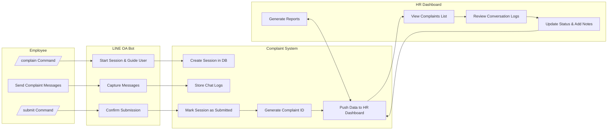

# IRC Complaint Management System

A secure, enterprise-grade complaint management system integrated with LINE OA for employee submissions and a Next.js dashboard for HR management.

## Overview

This system enables employees to submit complaints through LINE OA chat commands while providing HR teams with a secure web dashboard to manage, track, and resolve complaints efficiently.

## Features

### Employee Features (LINE OA)
- **Chat-first submission** using `/complain` and `/submit` commands
- Real-time conversation logging with timestamps
- Automatic complaint ID generation and acknowledgment
- User-friendly chat interface for detailed complaint descriptions

### HR Features (Web Dashboard)
- **Enterprise-grade security** with SSO + MFA authentication
- Role-based access control (HR personnel only)
- Comprehensive complaint management:
  - View and filter complaints by status, date, or employee
  - Review complete chat conversation logs
  - Update complaint status and add resolution notes
  - Generate summary reports and analytics

## Tech Stack

### Frontend (HR Dashboard)
- **Next.js 15** - React framework for production-ready applications
- **TailwindCSS + shadcn/ui** - Modern, responsive UI components
- **BetterAuth** - Secure authentication system

### Backend (API)
- **Node.js + Express** - RESTful API server
- **LINE Messaging API SDK** - LINE OA bot integration
- **JWT tokens** - Secure API authentication

### Database
- **MongoDB Atlas** - Cloud-native document database
- Collections:
  - `complaint_sessions` - Session management and metadata
  - `complaint_logs` - Chat message storage
  - `hr_actions` - HR notes and status updates

### Authentication & Security
- **SSO Integration** - Okta, Azure AD, Google Workspace support
- **OIDC (OpenID Connect) + OAuth2.0** - Industry-standard protocols
- **Multi-Factor Authentication (MFA)** - Enhanced security
- **AES-256 encryption** - Data protection at rest
- **TLS encryption** - Secure data transmission
- **Audit logging** - Complete access tracking

## System Architecture



## API Endpoints

- `POST /complaints/start` - Initialize complaint session
- `POST /complaints/log` - Store chat messages
- `POST /complaints/submit` - Finalize complaint submission
- `GET /complaints` - Retrieve complaints list (HR only)
- `GET /complaints/:id` - Get specific complaint details
- `PATCH /complaints/:id` - Update complaint status/notes

## Security Features

- **Zero-trust security model** with mandatory SSO authentication
- **Role-based access control** - HR personnel only
- **Comprehensive audit logging** - All actions tracked
- **Data encryption** - At rest and in transit
- **MFA enforcement** - Additional security layer
- **Regular security audits** - Compliance monitoring

## Performance & Reliability

- **99.9% uptime target** - High availability architecture
- **Auto-scaling MongoDB Atlas** - Handles growth seamlessly
- **10k+ complaints/year capacity** - Enterprise scalability
- **Daily automated backups** - Data protection
- **Performance monitoring** - Real-time system health

## Getting Started

### Prerequisites
- Node.js 18+
- MongoDB Atlas account
- LINE Developers account
- Enterprise SSO provider (Okta/Azure AD/Google)

### Installation
```bash
# Clone the repository
git clone https://github.com/leonaruebet/irc_p001_complain_system.git
cd irc_p001_complain_system

# Install dependencies
npm install

# Configure environment variables
cp .env.example .env

# Start development server
npm run dev
```

### Configuration
1. Set up LINE OA bot credentials
2. Configure MongoDB Atlas connection
3. Setup SSO provider integration
4. Configure authentication middleware
5. Deploy to production environment

## Success Metrics

- **Security Compliance**: 100% HR logins via SSO + MFA
- **User Adoption**: >80% complaints submitted via LINE OA
- **Operational Efficiency**: 30% faster HR resolution time
- **System Reliability**: >99.9% uptime achievement

## Future Enhancements

- AI-powered complaint classification and severity tagging
- Anonymous submission mode with privacy protection
- Slack/Email notification integrations
- Advanced reporting with PDF/CSV export capabilities
- Mobile app for HR personnel
- Integration with existing HR management systems

## Contributing

This project follows enterprise development standards with security-first principles. All contributions must pass security review and comply with organizational policies.

## License

Proprietary - Internal IRC Labs Project

## Support

For technical support or questions, contact the development team at the IRC Labs.

---

**Author**: Leo Naruebet  
**Project**: IRC_P001_Complain_System  
**Version**: 1.0.0  
**Last Updated**: September 2025